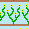

# WFC-TS: Wave Function Collapse Tile Generator

A interactive tool for exploring the Wave Function Collapse (WFC) algorithm in TypeScript. Extract tiles from sample images, visualize adjacencies, and generate new patterns with advanced controls and live feedback.
Deployed version [here](https://loethor.github.io/wfc-ts/).

---

## Features
- **Sample Image Selection**: Choose from a library of sample images or add your own.
- **Tile Extraction**: Extracts unique tiles and their frequencies from the sample.
- **Adjacency Viewer**: Visualize which tiles can border each other in each direction.
- **Live WFC Generation**: Watch the algorithm fill the grid step-by-step.
- **Advanced Reliability**: Includes lookahead, adaptive backtracking, and random restarts for robust generation.
- **Performance Optimized**: Efficient memory and DOM management for large grids and repeated runs.

---

## Example Output

### Sample


### Output


---

## Getting Started

### Prerequisites
- Node.js (v18+ recommended)
- npm

### Installation
```sh
# Clone the repository
npm install
npm run dev
```
Visit `http://localhost:5173` in your browser.

### Build for Production
```sh
npm run build
```

---

## Usage
- **Add Sample Images**: Place PNG/JPG files in the `public/samples/` folder.
- **Generate Tiles**: Select a sample, set tile size, and click "Generate Tiles".
- **Run WFC**: Set grid size and click "Generate WFC" to create new patterns.
- **Explore**: Hover tiles to see adjacencies and frequencies.

---

## Configuration
- Tile size, grid size, and other UI parameters can be adjusted in the app or in `src/config.ts`.

---

## Structure
- **src/**: Main TypeScript source code
	- `wfcGenerator.ts`: WFC algorithm core
	- `tileExtractor.ts`: Tile extraction logic
	- `appController.ts`: UI and app orchestration
	- `adjacencyViewer.ts`: Adjacency visualization
	- `tileSet.ts`: Tile data and rules
- **docs/**: Documentation and assets
- **public/samples/**: Sample images

---

---

## License
MIT License

Assets taken from the official [WFC repo](https://github.com/mxgmn/WaveFunctionCollapse)

---

## Credits & References
- Inspired by [mxgmn/WaveFunctionCollapse](https://github.com/mxgmn/WaveFunctionCollapse)
- Built with TypeScript and Vite

